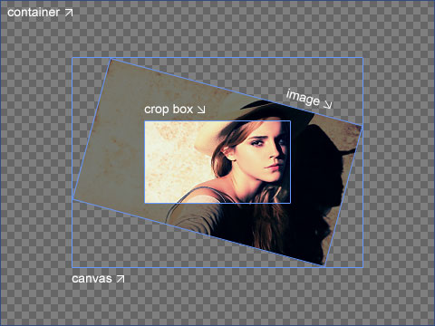

# [Image Cropper](https://github.com/fengyuanchen/cropper)

> A simple jQuery image cropping plugin.

- [Demo](http://fengyuanchen.github.io/cropper)


## Features

- Supports touch
- Supports zoom
- Supports rotation
- Supports canvas
- Supports [options](#options)
- Supports [methods](#methods)
- Supports [events](#events)
- Supports multiple croppers
- Supports RTL
- Cross-browser support


## Main

```
dist/
├── cropper.css     ( 6 KB)
├── cropper.min.css ( 5 KB)
├── cropper.js      (59 KB)
└── cropper.min.js  (22 KB)
```


## Getting started

### Quick start

Four quick start options are available:

- [Download the latest release](https://github.com/fengyuanchen/cropper/archive/master.zip).
- Clone the repository: `git clone https://github.com/fengyuanchen/cropper.git`.
- Install with [NPM](http://npmjs.org): `npm install cropper`.
- Install with [Bower](http://bower.io): `bower install cropper`.


### Installation

Include files:

```html
<script src="/path/to/jquery.js"></script><!-- jQuery is required -->
<link  href="/path/to/cropper.css" rel="stylesheet">
<script src="/path/to/cropper.js"></script>
```

#### [CDNJS](https://cdnjs.com/)

The CDNJS provides CDN support for Cropper's CSS and JavaScript. You can find the links [here](https://cdnjs.com/libraries/cropper).


#### [RawGit](https://rawgit.com/)

```html
<link  href="https://cdn.rawgit.com/fengyuanchen/cropper/v0.10.1/dist/cropper.min.css" rel="stylesheet">
<script src="https://cdn.rawgit.com/fengyuanchen/cropper/v0.10.1/dist/cropper.min.js"></script>
```


### Usage

Initialize with `$.fn.cropper` method.

```html
<!-- Wrap the image or canvas with a block element -->
<div class="container">
  
</div>
```

```js
$('.container > img').cropper({
  aspectRatio: 16 / 9,
  crop: function(data) {
    // Output the result data for cropping image.
  }
});
```

#### Notes

- The size of the cropper inherits from the size of the image's parent element (wrapper), so be sure to wrap the image with a visible block element.

- The outputted cropped data bases on the original image size, so you can use them to crop the image directly.

- If you try to start cropper on a cross-origin image, please make sure that your browser supports HTML5 [CORS settings attributes](https://developer.mozilla.org/en-US/docs/Web/HTML/CORS_settings_attributes), and your image server supports the `Access-Control-Allow-Origin` option.


#### Known issues

- About `getCroppedCanvas` method: The `canvas.drawImage` API in some Mac OS / iOS browsers will rotate an image with EXIF Orientation automatically, so the output cropped canvas may be incorrect. To fix this, you may upload the cropped data and crop the image in the server-side, see the example: [Crop Avatar](examples/crop-avatar). Or you may handle the EXIF Orientation in server first before to use cropper.

- [Known iOS resource limits](https://developer.apple.com/library/mac/documentation/AppleApplications/Reference/SafariWebContent/CreatingContentforSafarioniPhone/CreatingContentforSafarioniPhone.html): As iOS devices limit memory, the browser may crash when you are cropping a large image (iPhone camera resolution). To avoid this, you may resize the image first (below 1024px) before start a cropper.


## Options

You may set cropper options with `$().cropper(options)`.
If you want to change the global default options, You may use `$.fn.cropper.setDefaults(options)`.


### aspectRatio

- Type: `Number`
- Default: `NaN`

Set the aspect ratio of the crop box. By default, the crop box is free ratio.


### data

- Type: `Object`
- Default: `null`

The previous cropped data if you had stored, will be passed to `setData` method automatically.


### crop

- Type: `Function`
- Default: `null`

This function will be executed when changes the crop box or image.


### preview

- Type: `String` (**jQuery selector**)
- Default: `''`

Add extra elements (containers) for previewing.

**Notes:**

- The maximum width is the initial width of preview container.
- The maximum height is the initial height of preview container.
- If you set an `aspectRatio` option, be sure to set the preview container with the same aspect ratio.


### strict

- Type: `Boolean`
- Default: `true`

In strict mode, the canvas cannot be smaller than the container, and the crop box cannot be outside of the canvas.


### responsive

- Type: `Boolean`
- Default: `true`

Rebuild the cropper when resize the window.


### checkImageOrigin

- Type: `Boolean`
- Default: `true`

By default, the plugin will check the image origin, and if it is a cross-origin image, a `crossOrigin` attribute will be added to the image element and a timestamp will be added to the image url to reload the image for "getCroppedCanvas".

By adding `crossOrigin` attribute to image will stop adding timestamp to image url, and stop reload of image.


### modal

- Type: `Boolean`
- Default: `true`

Show the black modal above the image and under the crop box.


### guides

- Type: `Boolean`
- Default: `true`

Show the dashed lines above the crop box.


### center

- Type: `Boolean`
- Default: `true`

Show the center indicator above the crop box.


### highlight

- Type: `Boolean`
- Default: `true`

Show the white modal above the crop box (highlight the crop box).


### background

- Type: `Boolean`
- Default: `true`

Show the grid background of the container.


### autoCrop

- Type: `Boolean`
- Default: `true`

Enable to crop the image automatically when initialize.


### autoCropArea

- Type: `Number`
- Default: `0.8` (80% of the image)

A number between 0 and 1. Define the automatic cropping area size (percentage).


### dragCrop

- Type: `Boolean`
- Default: `true`

Enable to remove the current crop box and create a new one by dragging over the image.


### movable

- Type: `Boolean`
- Default: `true`

Enable to move the image.


### rotatable

- Type: `Boolean`
- Default: `true`

Enable to rotate the image.


### zoomable

- Type: `Boolean`
- Default: `true`

Enable to zoom the image.


### mouseWheelZoom

- Type: `Boolean`
- Default: `true`

Enable to zoom the image by wheeling mouse.


### touchDragZoom

- Type: `Boolean`
- Default: `true`

Enable to zoom the image by dragging touch.


### cropBoxMovable

- Type: `Boolean`
- Default: `true`

Enable to move the crop box.


### cropBoxResizable

- Type: `Boolean`
- Default: `true`

Enable to resize the crop box.


### doubleClickToggle

- Type: `Boolean`
- Default: `true`

Enable to toggle drag mode between "crop" and "move" when double click on the cropper.


### minContainerWidth

- Type: `Number`
- Default: `200`

The minimum width of the container.


### minContainerHeight

- Type: `Number`
- Default: `100`

The minimum height of the container.


### minCanvasWidth

- Type: `Number`
- Default: `0`

The minimum width of the canvas (image wrapper).


### minCanvasHeight

- Type: `Number`
- Default: `0`

The minimum height of the canvas (image wrapper).


### minCropBoxWidth

- Type: `Number`
- Default: `0`

The minimum width of the crop box.


### minCropBoxHeight

- Type: `Number`
- Default: `0`

The minimum height of the crop box.


### build

- Type: `Function`
- Default: `null`

A shortcut of the "build.cropper" event.


### built

- Type: `Function`
- Default: `null`

A shortcut of the "built.cropper" event.


### dragstart

- Type: `Function`
- Default: `null`

A shortcut of the "dragstart.cropper" event.


### dragmove

- Type: `Function`
- Default: `null`

A shortcut of the "dragmove.cropper" event.


### dragend

- Type: `Function`
- Default: `null`

A shortcut of the "dragend.cropper" event.


### zoomin

- Type: `Function`
- Default: `null`

A shortcut of the "zoomin.cropper" event.


### zoomout

- Type: `Function`
- Default: `null`

A shortcut of the "zoomout.cropper" event.


### change

- Type: `Function`
- Default: `null`

A shortcut of the "change.cropper" event.


## Methods

As there is a asynchronous process when load the image, you should call most of the methods after built, except "setAspectRatio", "replace" and "destroy".

```js
$().cropper({
  built: function () {
    $().cropper('method', argument1, , argument2, ..., argumentN);
  }
});
```


### crop()

Show the crop box manually.

```js
$().cropper({
  autoCrop: false,
  built: function () {
    // Do something here
    // ...

    // And then
    $(this).cropper('crop');
  }
});
```


### move(offsetX, offsetY)

- **offsetX**:
  - Type: `Number`
  - Moving size (px) in the horizontal direction
- **offsetY**:
  - Type: `Number`
  - Moving size (px) in the vertical direction

Move the image.

```js
$().cropper('move', 1, 0)
$().cropper('move', 0, -1)

```


### zoom(ratio)

- **ratio**:
  - Type: `Number`
  - Zoom in: requires a positive number (ratio > 0)
  - Zoom out: requires a negative number (ratio < 0)

Zoom the image.

```js
$().cropper('zoom', 0.1)
$().cropper('zoom', -0.1)
```


### rotate(degree)

- **degree**:
  - Type: `Number`
  - Rotate right: requires a positive number (degree > 0)
  - Rotate left: requires a negative number (degree < 0)

Rotate the image. Requires CSS3 [Transforms3d](http://caniuse.com/transforms3d) support (IE 10+).

```js
$().cropper('rotate', 90)
$().cropper('rotate', -90)
```


### enable()

Enable (unfreeze) the cropper.


### disable()

Disable (freeze) the cropper.


### reset()

Reset the image and crop box to the initial states.


### clear()

Clear the crop box.


### replace(url)

- **url**:
  - Type: `String`
  - A new image url.

Replace the image and rebuild the cropper.


### destroy()

Destroy the cropper and remove the instance from the image.


### getData([rounded])

- **rounded** (optional):
  - Type: `Boolean`
  - Default: `false`
  - Set `true` to get rounded values.

- (return value):
  - Type: `Object`
  - Properties:
    - `x`: the offset left of the cropped area
    - `y`: the offset top of the cropped area
    - `width`: the width of the cropped area
    - `height`: the height of the cropped area
    - `rotate`: the rotated degrees of the image

Get the cropped area data (base on the original image).


### setData(data)

- **data**:
  - Type: `Object`
  - Properties: See the [`getData`](#getData) method.

Set the cropped area data (base on the original image).

**Note:** Only available in strict mode.


### getContainerData()

- (return  value):
  - Type: `Object`
  - Properties:
    - `width`: the current width of the container
    - `height`: the current height of the container

Output the container size data.




### getImageData()

- (return  value):
  - Type: `Object`
  - Properties:
    - `left`: the offset left of the image
    - `top`: the offset top of the image
    - `width`: the width of the image
    - `height`: the height of the image

Output the image position and size.


### getCanvasData()

- (return  value):
  - Type: `Object`
  - Properties:
    - `left`: the offset left of the canvas
    - `top`: the offset top of the canvas
    - `width`: the width of the canvas
    - `height`: the height of the canvas

Output the canvas (image wrapper) position and size.


### setCanvasData(data)

- **data**:
  - Type: `Object`
  - Properties:
    - `left`: the new offset left of the canvas
    - `top`: the new offset top of the canvas
    - `width`: the new width of the canvas
    - `height`: the new height of the canvas

Change the canvas (image wrapper) position and size.


### getCropBoxData()

- (return  value):
  - Type: `Object`
  - Properties:
    - `left`: the offset left of the crop box
    - `top`: the offset top of the crop box
    - `width`: the width of the crop box
    - `height`: the height of the crop box

Output the crop box position and size.


### setCropBoxData(data)

- **data**:
  - Type: `Object`
  - Properties:
    - `left`: the new offset left of the crop box
    - `top`: the new offset top of the crop box
    - `width`: the new width of the crop box
    - `height`: the new height of the crop box

Change the crop box position and size.


### getCroppedCanvas([options])

- **options** (optional):
  - Type: `Object`
  - Properties:
    - `width`: the destination width of the output canvas
    - `height`: the destination height of the output canvas
    - `fillColor`: a color to fill any alpha values in the output canvas

- (return  value):
  - Type: `HTMLCanvasElement`
  - A canvas drawn the cropped image.

- Browser support:
  - Basic image: requires [Canvas](http://caniuse.com/canvas) support (IE 9+).
  - Rotated image: requires CSS3 [Transforms3d](http://caniuse.com/transforms3d) support (IE 10+).
  - Cross-origin image: requires HTML5 [CORS settings attributes](https://developer.mozilla.org/en-US/docs/Web/HTML/CORS_settings_attributes) support (IE 11+).

Get a canvas drawn the cropped image.

> After then, you can display the canvas as an image directly, or use [canvas.toDataURL](https://developer.mozilla.org/en-US/docs/Web/API/HTMLCanvasElement/toDataURL) to get a Data URL, or use [canvas.toBlob](https://developer.mozilla.org/en-US/docs/Web/API/HTMLCanvasElement/toBlob) to get a blob and upload it to server with [FormData](https://developer.mozilla.org/en/XMLHttpRequest/FormData) if the browser supports these APIs.

```js
$().cropper('getCroppedCanvas')

$().cropper('getCroppedCanvas', {
  width: 160,
  height: 90
});
```

### setAspectRatio(aspectRatio)

- **aspectRatio**:
  - Type: `Number`
  - Requires a positive number.

Change the aspect ratio of the crop box.


### setDragMode([mode])

- **mode** (optional):
  - Type: `String`
  - Default: `'none'`
  - Options: `'none'`, `'crop'`, `'move'`

Change the drag mode.

**Tips:** You can toggle the "crop" and "move" mode by double click on the cropper.


## Events

### build.cropper

This event fires when a cropper instance starts to load a image.


### built.cropper

This event fires when a cropper instance has built completely.


### dragstart.cropper

- **event.dragType**:
  - "crop": create a new crop box
  - "move": move the canvas
  - "zoom": zoom in / out the canvas by dragging touch.
  - "e": resize the east side of the crop box
  - "w": resize the west side of the crop box
  - "s": resize the south side of the crop box
  - "n": resize the north side of the crop box
  - "se": resize the southeast side of the crop box
  - "sw": resize the southwest side of the crop box
  - "ne": resize the northeast side of the crop box
  - "nw": resize the northwest side of the crop box
  - "all": move the crop box

This event fires when the crop box starts to change.

> Related original events: "mousedown", "touchstart" and "pointerdown".

```js
$().on('dragstart.cropper', function (e) {
  console.log(e.type); // dragstart
  console.log(e.namespace); // cropper
  console.log(e.dragType); // ...
});
```


### dragmove.cropper

- **event.dragType**: The same as "dragstart.cropper".

This event fires when the crop box is changing.

> Related original events: "mousemove", "touchmove" and "pointermove".


### dragend.cropper

- **event.dragType**: The same as "dragstart.cropper".

This event fires when the crop box stops to change.

> Related original events: "mouseup", "touchend", "touchcancel", "pointerup" and "pointercancel".


### zoomin.cropper

This event fires when a cropper instance starts to zoom in its canvas.


### zoomout.cropper

This event fires when a cropper instance starts to zoom out its canvas.


### change.cropper

This event fires when the image or the crop box changed.


## No conflict

If you have to use other plugin with the same namespace, just call the `$.fn.cropper.noConflict` method to revert to it.

```html
<script src="other-plugin.js"></script>
<script src="cropper.js"></script>
<script>
  $.fn.cropper.noConflict();
  // Code that uses other plugin's "$().cropper" can follow here.
</script>
```


## Browser support

- Chrome (latest 2)
- Firefox (latest 2)
- Internet Explorer 8+
- Opera (latest 2)
- Safari (latest 2)

As a jQuery plugin, you also need to see the [jQuery Browser Support](http://jquery.com/browser-support/).


## [License](LICENSE.md)

Released under the [MIT](http://opensource.org/licenses/mit-license.html) license.


## Related projects

- [react-cropper](https://github.com/roadmanfong/react-cropper) - Cropper as React components.
- [ngCropper](https://github.com/koorgoo/ngCropper) - AngularJS wrapper for Cropper.
- [ember-cli-cropper](https://github.com/anilmaurya/ember-cli-cropper) - Ember cli addon for Cropper.
- [ember-cli-image-cropper](https://github.com/mhretab/ember-cli-image-cropper) - Ember-cli addon for cropping/resizing images based on the jQuery Cropper plugin.
